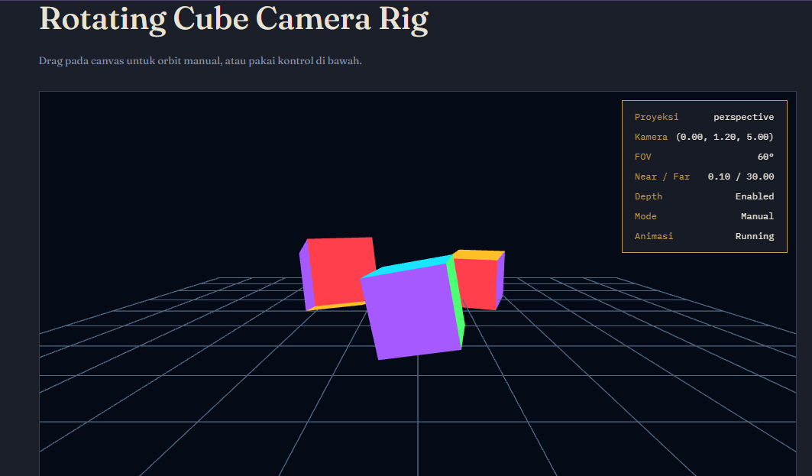

# Praktikum 04 — Rotating Cube Camera Rig (WebGL2)

## Identitas

| Nama | NRP |
| --- | --- |
| Nyoman Surya Hutama Andyartha | 5025241093 |
| Willy Dava Nugraha | 5025241090 |

## Deskripsi

Playground interaktif untuk mempelajari **kamera, proyeksi, dan transformasi 3D**
menggunakan WebGL2 murni (tanpa library eksternal). Tiga kubus digambar pada
kedalaman berbeda, dengan kamera yang bisa dikendalikan secara manual (drag mouse,
keyboard) maupun otomatis (orbit).

## Struktur File

| File | Fungsi |
|---|---|
| `index.html` | Markup halaman, canvas, HUD, dan panel kontrol |
| `style.css` | Styling tema "arsip" (dark UI + panel kertas untuk kontrol) |
| `math3d.js` | Fungsi matematika matriks 4x4: `multiply`, `translation`, `rotationX/Y`, `perspective`, `orthographic`, `lookAt`, dll |
| `main.js` | Setup WebGL2, shader, geometry kubus & grid, render loop, state, input handling |

## Cara Menjalankan

Karena project ini memakai modul JS biasa (bukan ES module) dan `fetch` shader
inline, cukup buka `index.html` lewat local server (disarankan, agar tidak kena
batasan `file://`), misalnya:

```bash
npx serve .
# atau
python3 -m http.server
```

Lalu buka `http://localhost:<port>` di browser yang mendukung **WebGL2**.

## Fitur Utama

- **Proyeksi ganda**: perspective ↔ orthographic (tombol/keyboard `P`)
- **Split view**: perspective di kiri, orthographic di kanan sekaligus (`X`)
- **Orbit camera otomatis**: kamera berputar mengelilingi target (`B`)
- **Orbit manual via drag**: klik-drag pada canvas untuk memutar kamera bebas
  (mouse/touch, pakai Pointer Events)
- **Tiga kubus** pada posisi & kedalaman berbeda, masing-masing berotasi dengan
  kecepatan sendiri
- **Grid lantai** sebagai referensi spasial (`G`)
- **Depth test** on/off untuk melihat efek occlusion (`D`)
- **Panel debug matrix**: menampilkan matriks View & Projection real-time (`M`)
- **Preset Near/Far** dan **Preset FOV** (35° / 60° / 90°)
- **Slider**: FOV, tinggi kamera, target X, target Y
- **Pause animasi** (`Space`)
- **Reset** seluruh state ke kondisi awal (`R`)

## Kontrol Keyboard

| Tombol | Aksi |
|---|---|
| `←` `→` | Geser kamera sumbu X (nonaktif saat mode orbit aktif) |
| `↑` `↓` | Geser kamera sumbu Y (tinggi) |
| `W` `S` | Geser kamera sumbu Z (nonaktif saat mode orbit aktif) |
| `P` | Ganti proyeksi perspective ↔ orthographic |
| `B` | Toggle orbit kamera otomatis |
| `X` | Toggle split view |
| `D` | Toggle depth test |
| `G` | Toggle grid lantai |
| `M` | Toggle panel debug matrix |
| `N` | Ganti preset near/far plane |
| `[` `]` | Kurangi / tambah FOV (step 5°) |
| `Space` | Pause / resume animasi |
| `R` | Reset scene |

> Catatan: shortcut keyboard otomatis tidak aktif ketika fokus sedang berada
> pada elemen `<input>` (slider), supaya panah kiri/kanan tetap berfungsi
> normal untuk slider.

## Kontrol Mouse/Touch

Klik dan drag di atas canvas untuk orbit kamera secara manual (spherical
coordinates: yaw & pitch), dengan pitch dibatasi ±75° agar kamera tidak
"terbalik" melewati kutub. Drag manual otomatis menonaktifkan mode orbit
otomatis.

## Konsep Grafika yang Dipraktikkan

1. **Model–View–Projection (MVP) pipeline** — `u_model`, `u_view`, `u_projection`
   dikirim sebagai uniform mat4 ke vertex shader.
2. **Kamera lookAt** — dibangun dari posisi mata, target, dan vektor up,
   termasuk penanganan kasus degenerate (mata sejajar sumbu up, atau mata
   berimpit dengan target) via fallback up-vector dan clamp jarak minimum.
3. **Proyeksi perspective vs orthographic** — perbandingan langsung lewat
   split view.
4. **Depth testing** — efek `gl.DEPTH_TEST` terhadap urutan render objek yang
   overlap.
5. **Transformasi hierarkis sederhana** — kombinasi translation × rotationY ×
   rotationX per objek.
6. **Viewport & scissor test** — dipakai untuk membagi canvas pada split view.
7. **Responsive canvas** — sinkronisasi resolusi drawing buffer dengan ukuran
   CSS (device pixel ratio aware) agar aspect ratio tetap benar.

# Screenshot

