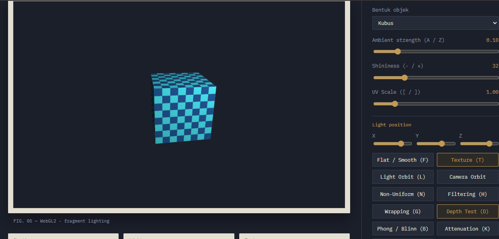

# Praktikum 05 — Textured and Lit Object Playground 

## Identitas

| Nama | NRP |
| --- | --- |
| Nyoman Surya Hutama Andyartha | 5025241093 |
| Willy Dava Nugraha | 5025241090 |

# Deskripsi

Playground interaktif berbasis **WebGL2** untuk mempelajari **lighting, shading, dan texture mapping**. Seluruh perhitungan pencahayaan dilakukan di **fragment shader** (per-fragment lighting), sehingga efek perubahan parameter bisa diamati langsung secara real-time.

## Tujuan Pembelajaran

- Memahami hubungan **normal vector**, arah cahaya, dan arah pandang terhadap warna permukaan.
- Membedakan komponen **Ambient, Diffuse, dan Specular** (model Phong).
- Membandingkan **Phong vs Blinn-Phong** pada specular highlight.
- Membedakan **flat shading** (face normal) dan **smooth shading** (normal per-vertex yang diinterpolasi).
- Memahami **texture mapping**: koordinat UV, filtering, wrapping, dan mipmap.
- Memahami **attenuation** (redaman cahaya titik) dan **gamma correction**.
- Memahami mengapa objek dengan **non-uniform scale** membutuhkan **Normal Matrix**.

## Struktur Proyek

```
.
├── index.html     # Struktur halaman: canvas, HUD, panel kontrol
├── style.css      # Tema visual "arsip" (tinta gelap, kertas, kuningan)
├── main.js        # Logika utama: shader, geometri, tekstur, state, input, render loop
├── math3d.js      # Helper matriks 4x4 column-major (versi modul ES)
└── texture.svg    # Gambar untuk opsi "Image texture"
```

> **Catatan:** `main.js` dimuat dengan `<script src="./main.js">` biasa (bukan `type="module"`) dan sudah memiliki helper matriks sendiri (`multiply`, `lookAt`, `perspective`, dst., dengan sudut dalam derajat). `math3d.js` adalah versi modul ES yang setara (sudut dalam radian) dan belum di-import oleh `main.js`. Jika ingin memakainya, ubah tag script menjadi `type="module"` dan `import { Mat4, normalMatrixFromMat4 } from "./math3d.js"`.

## Alur Rendering

1. **Vertex shader** mengubah posisi vertex ke world space dan clip space, mengubah normal dengan Normal Matrix, serta mengalikan UV dengan `u_uvScale`.
2. Nilai `v_worldPosition`, `v_normal`, dan `v_uv` **diinterpolasi** oleh rasterizer ke setiap fragment.
3. **Fragment shader** menghitung vektor `N`, `L`, `V`, lalu menggabungkan ambient + diffuse + specular dengan warna dasar (tekstur atau warna polos).
4. Posisi lampu digambar sebagai bola kecil **unlit** (tanpa lighting) agar mudah terlihat.

## Lighting

Cahaya yang digunakan adalah **point light** berwarna putih pada posisi yang bisa digeser. Hasil akhir:

```
color = ambient + diffuse + specular
```

| Komponen | Rumus (di shader) | Efek |
|---|---|---|
| **Ambient** | `ambientStrength × lightColor × baseColor` | Cahaya dasar agar sisi gelap tidak hitam pekat |
| **Diffuse** | `max(dot(N, L), 0) × lightColor × baseColor` | Terang-gelap permukaan bergantung sudut terhadap cahaya (Lambert) |
| **Specular** | `pow(max(dot(R, V), 0), shininess) × lightColor` | Kilau/highlight yang bergantung posisi kamera |

Keterangan vektor (semuanya dinormalisasi):

- `N` — normal permukaan
- `L` — arah dari fragment ke lampu: `normalize(lightPos − worldPos)`
- `V` — arah dari fragment ke kamera: `normalize(cameraPos − worldPos)`
- `R` — vektor pantul: `reflect(−L, N)`

Setiap komponen dapat dinyalakan/dimatikan (tombol **1 / 2 / 3** atau checkbox) untuk melihat kontribusinya masing-masing.

### Phong vs Blinn-Phong

- **Phong:** `spec = pow(max(dot(R, V), 0), shininess)`
- **Blinn-Phong:** memakai half vector `H = normalize(L + V)`, sehingga `spec = pow(max(dot(N, H), 0), shininess × 4)`

Shininess Blinn-Phong dikalikan 4 agar ukuran highlight kira-kira sebanding dengan Phong. Blinn-Phong umumnya lebih stabil pada sudut pandang yang landai. Ganti model dengan tombol **B**.

### Attenuation (Redaman Cahaya)

Intensitas cahaya berkurang seiring jarak `d` dari lampu:

```
att = 1 / (kc + kl·d + kq·d²)    dengan kc = 1.0, kl = 0.09, kq = 0.032
```

Nilai hasil dikalikan 2.2 agar objek tidak terlalu gelap. Attenuation memengaruhi diffuse dan specular (ambient tidak teredam). Aktifkan dengan tombol **K**.

### Gamma Correction

Jika aktif (**C**), warna tekstur diubah dari sRGB ke ruang linear (`pow(color, 2.2)`), pencahayaan dihitung di ruang linear, lalu hasil akhir dikembalikan ke sRGB (`pow(color, 1/2.2)`). Perhitungan cahaya di ruang linear memberi gradasi yang lebih akurat secara fisik dibanding perhitungan langsung di sRGB.

## Shading: Flat vs Smooth

Geometri dibuat dengan **dua set normal**:

- **Flat** — satu *face normal* untuk setiap segitiga, sehingga tiap sisi terlihat berfaset dengan warna seragam.
- **Smooth** — normal per-vertex (dari rumus parametrik permukaan, atau arah pusat→vertex pada kubus) yang diinterpolasi di dalam segitiga, sehingga permukaan tampak halus.

Tombol **F** berpindah di antara keduanya. Saat memilih bentuk lengkung (torus, torus knot, bola), shading otomatis dimulai dari *smooth*; pada kubus dimulai dari *flat*.

## Normal Matrix & Non-Uniform Scale

Jika normal dikalikan langsung dengan Model Matrix yang memiliki scale tidak seragam, normal tidak lagi tegak lurus terhadap permukaan dan pencahayaan menjadi salah. Solusinya adalah **Normal Matrix**, yaitu *inverse-transpose* dari bagian linear 3×3 Model Matrix:

```
Normal Matrix = (M₃ₓ₃)⁻ᵀ = [c1×c2, c2×c0, c0×c1] / det
```

Fungsi `normalMatrixFromMat4()` menghitungnya lewat cross product kolom-kolom matriks. Tekan **N** atau gunakan slider *Non-uniform scale* untuk membuktikan bahwa pencahayaan tetap benar saat objek diregangkan.

## Texture

### Sumber Tekstur

- **Checkerboard** — dibuat prosedural lewat canvas 2D (128×128, kotak 8×8 berwarna biru dan cyan).
- **Image texture** — memuat `texture.svg` (dengan `UNPACK_FLIP_Y_WEBGL`). Sebelum gambar selesai dimuat, dipakai placeholder 1×1 piksel.

Tombol **T** menyalakan/mematikan tekstur; jika mati, objek memakai warna polos `(0.35, 0.78, 1.0)`.

### Koordinat UV dan UV Scale

Koordinat UV dinormalisasi 0..1 pada seluruh permukaan. Slider **UV Scale** (`[` / `]`) mengalikan UV di vertex shader sehingga tekstur diulang lebih rapat (atau lebih renggang). Efeknya paling jelas terlihat bersama mode wrapping.

### Filtering

| Mode | Perilaku |
|---|---|
| `LINEAR` | Interpolasi bilinear antar texel (halus) |
| `NEAREST` | Texel terdekat (kotak-kotak tajam/pixelated) |
| `LINEAR_MIPMAP_LINEAR` | Interpolasi antar texel dan antar level mipmap (paling halus, mengurangi aliasing saat objek jauh/miring) |
| `NEAREST_MIPMAP_NEAREST` | Texel dan level mipmap terdekat |

Mipmap dibuat dengan `gl.generateMipmap()`. Untuk mode *nearest*, magnification filter juga diset `NEAREST`. Ganti dengan tombol **H** atau dropdown *Filtering*.

### Wrapping

Menentukan perilaku saat UV di luar rentang 0..1 (misalnya ketika UV Scale > 1):

- `REPEAT` — tekstur diulang
- `CLAMP_TO_EDGE` — piksel tepi diperpanjang
- `MIRRORED_REPEAT` — tekstur diulang dengan cermin bergantian

Ganti dengan tombol **G** atau dropdown *Wrapping*.

## Bentuk Objek

| Bentuk | Keterangan |
|---|---|
| Kubus | 6 sisi, 36 vertex, normal flat per sisi |
| Torus | Permukaan parametrik, 64 × 32 segmen |
| Torus Knot | Simpul parametrik, 160 × 32 segmen, normal dihitung numerik dari turunan permukaan |
| Bola | Permukaan parametrik, 64 × 32 segmen |

Objek berotasi otomatis pada sumbu X dan Y (hentikan dengan **P**). Kamera berada di `(0, 1.3, 5)` dengan proyeksi perspektif FOV 60° dan dapat dibuat mengorbit.

## Kontrol

### Keyboard

| Tombol | Fungsi |
|---|---|
| `←` `→` / `↑` `↓` | Geser lampu pada sumbu X / Y |
| `W` / `S` | Geser lampu pada sumbu Z |
| `Q` / `E` | Geser kamera pada sumbu X |
| `A` / `Z` | Tambah / kurangi ambient |
| `-` / `+` | Kurangi / tambah shininess |
| `[` / `]` | Kurangi / tambah UV scale |
| `F` | Flat / Smooth shading |
| `T` | Texture on/off |
| `H` | Ganti filtering |
| `G` | Ganti wrapping |
| `1` / `2` / `3` | Toggle ambient / diffuse / specular |
| `N` | Uniform / Non-uniform scale |
| `D` | Depth test on/off |
| `B` | Phong / Blinn-Phong |
| `K` | Attenuation on/off |
| `C` | Gamma correction on/off |
| `L` | Light orbit (lampu mengitari objek) |
| `P` | Stop / resume rotasi objek |
| `R` | Reset scene |

### Panel Kontrol

Semua parameter di atas juga tersedia lewat tombol, slider, dropdown, dan checkbox di panel kanan. UI dan state selalu disinkronkan, sehingga perubahan lewat keyboard, orbit, atau reset tercermin di slider dan HUD.

### HUD

Kartu HUD di bawah canvas menampilkan nilai terkini: shading, posisi lampu, texture, filtering, wrapping, kamera, UV scale, shininess, ambient, komponen aktif (A/D/S), scale, depth test, model specular, attenuation, dan gamma.

# Screenshot

